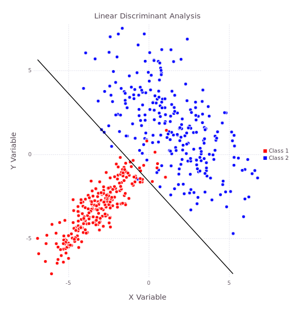

# Discriminant Analysis

[](http://discriminantanalysis.readthedocs.org/en/latest/?badge=latest)
[](https://travis-ci.org/trthatcher/DiscriminantAnalysis.jl)
[](https://coveralls.io/github/trthatcher/DiscriminantAnalysis.jl?branch=master)

#### Summary

**DiscriminantAnalysis.jl** is a Julia package for multiple linear and quadratic 
regularized discriminant analysis (LDA & QDA respectively). LDA and QDA are
distribution-based classifiers with the underlying assumption that data follows
a multivariate normal distribution. LDA differs from QDA in the assumption about 
the class variability; LDA assumes that all classes share the same within-class 
covariance matrix whereas QDA relaxes that constraint and allows for distinct 
within-class covariance matrices. This results in LDA being a linear classifier
and QDA being a quadratic classifier.

#### Documentation

Full [documentation](http://discriminantanalysis.readthedocs.org/en/latest/) is
available on Read the Docs.

#### Visualization

When the data is modelled via linear discriminant analysis, the resulting
classification boundaries are hyperplanes (lines in two dimensions):

<p align="center"></p>

Using quadratic discriminant analysis, the resulting classification boundaries
are quadratics:

<p align="center"></p>


## Getting Started

If the package has not yet been installed, run the following line of code:

```julia
Pkg.add("DiscriminantAnalysis")
```

Sample code is available in [example.jl](example/example.jl). To get started,
run the following block of code:

```julia
using DataFrames, DiscriminantAnalysis;

iris_df = readtable("iris.csv");
pool!(iris_df, [:Species]);  # Ensure species is made a pooled data vector
```

Although [Dataframes.jl](https://github.com/JuliaStats/DataFrames.jl) is not
required, it will help to stage the data. We require a data matrix (row-major 
or column-major ordering of the observations). We then define the data matrix
``X`` and the class reference vector ``y`` (vector of 1-based class indicators):

```julia
X = convert(Array{Float64}, iris_df[[:PetalLength, :PetalWidth, :SepalLength, :SepalWidth]]);
y = iris_df[:Species].refs;  # Class indices
```

A Linear Discriminant model can be created using the ``lda`` function:

```julia
julia> model1 = lda(X, y)
Linear Discriminant Model

Regularization Parameters:
    γ = N/A

Class Priors:
    Class 1 Probability: 33.3333%
    Class 2 Probability: 33.3333%
    Class 3 Probability: 33.3333%

Class Means:
    Class 1 Mean: [1.464, 0.244, 5.006, 3.418]
    Class 2 Mean: [4.26, 1.326, 5.936, 2.77]
    Class 3 Mean: [5.552, 2.026, 6.588, 2.974]
```

Once the model is defined, we can use it to classify new data with the
``classify`` function:

```julia
julia> y_pred1 = classify(model1, X);

julia> accuracy1 = sum(y_pred1 .== y)/length(y)
0.98
```

By default, the LDA model assumes the data is in row-major ordering of
observations, the class weights are equal and that the regularization parameter
gamma is unspecified. 

```julia
julia> model2 = lda(X', y, order = Val{:col}, gamma = 0.1, priors = [2/5; 2/5; 1/5])
Linear Discriminant Model

Regularization Parameters:
    γ = 0.1

Class Priors:
    Class 1 Probability: 40.0%
    Class 2 Probability: 40.0%
    Class 3 Probability: 20.0%

Class Means:
    Class 1 Mean: [1.464, 0.244, 5.006, 3.418]
    Class 2 Mean: [4.26, 1.326, 5.936, 2.77]
    Class 3 Mean: [5.552, 2.026, 6.588, 2.974]


julia> y_pred2 = classify(model2, X');

julia> accuracy2 = sum(y_pred2 .== y)/length(y)
0.98
```

We may also fit a Quadratic Discriminant model using the ``qda`` function:

```julia
julia> model3 = qda(X, y, lambda = 0.1, gamma = 0.1, priors = [1/3; 1/3; 1/3])
Quadratic Discriminant Model

Regularization Parameters:
    γ = 0.1
    λ = 0.1

Class Priors:
    Class 1 Probability: 33.3333%
    Class 2 Probability: 33.3333%
    Class 3 Probability: 33.3333%

Class Means:
    Class 1 Mean: [1.464, 0.244, 5.006, 3.418]
    Class 2 Mean: [4.26, 1.326, 5.936, 2.77]
    Class 3 Mean: [5.552, 2.026, 6.588, 2.974]


julia> y_pred3 = classify(model3, X);

julia> accuracy3 = sum(y_pred3 .== y)/length(y)
0.9866666666666667
```

Finally, if the number of classes is less than or equal to the number of
parameters, then a Canonical Discriminant model may be used in place of a Linear
Discriminant model to simultaneously reduce the dimensionality of the
classifier:

```julia
julia> model4 = cda(X, y, gamma = Nullable{Float64}(), priors = [1/3; 1/3; 1/3])
Canonical Discriminant Model

Regularization Parameters:
    γ = N/A

Class Priors:
    Class 1 Probability: 33.3333%
    Class 2 Probability: 33.3333%
    Class 3 Probability: 33.3333%

Class Means:
    Class 1 Mean: [1.464, 0.244, 5.006, 3.418]
    Class 2 Mean: [4.26, 1.326, 5.936, 2.77]
    Class 3 Mean: [5.552, 2.026, 6.588, 2.974]


julia> y_pred4 = classify(model4, X);

julia> accuracy4 = sum(y_pred4 .== y)/length(y)
0.98
```
