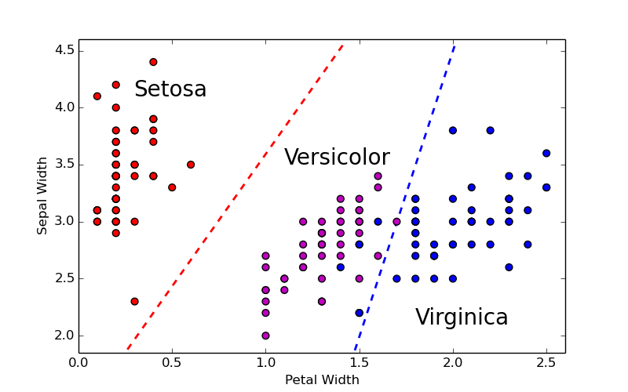
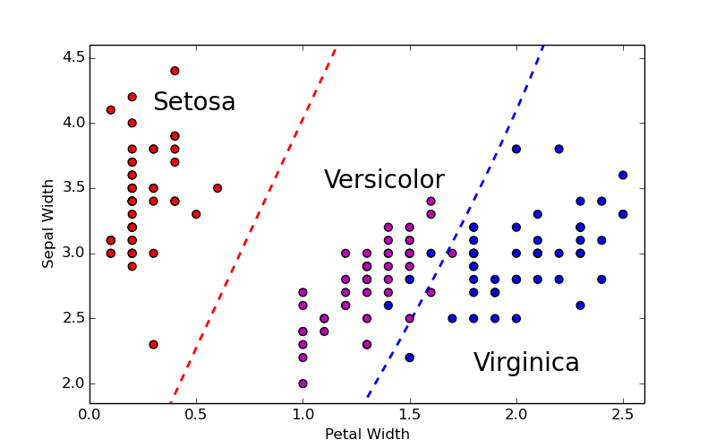

Discriminant Analysis
=====================

`DiscriminantAnalysis.jl`_ is a Julia package for multiple linear and quadratic 
regularized discriminant analysis (LDA & QDA respectively). LDA and QDA are
distribution-based classifiers that make the (strong) assumption that the 
underlying data follows a multivariate normal distribution. LDA is distinct from
QDA in the assumption about the class variability; LDA assumes that all classes 
have the same variance whereas QDA allows each class to have its own covariance
matrix. This results in LDA being a linear classifier and QDA being a quadratic
classifier.

.. contents::

.. _DiscriminantAnalysis.jl: https://github.com/trthatcher/DiscriminantAnalysis.jl

Classification Rules
--------------------

Linear and Quadratic Discriminant Analysis in the context of classification 
arise as simple probabilistic classifiers. Discriminant Analysis works under the
assumption that each class follows a Gaussian distribution. That is, for each
class :math:`k`, the probability distribution can be modelled by:

.. math::
    
    f_k(x) = \frac{\exp\left((\mathbf{x}-\mathbf{\mu_k})^{\intercal}\Sigma_k^{-1}(\mathbf{x}-\mathbf{\mu_k})\right)}{(2\pi)^{p/2}\left|\Sigma_k\right|^{1/2}}

Let :math:`\pi_k` represent the prior class membership probabilities. 
Application of Baye's Theorem results in:

.. math::

    P(K = k | X = \mathbf{x}) = \frac{f_k(\mathbf{x})\pi_k}{\sum_i f_i(\mathbf{x})\pi_i}

Following rule can be used for classification:

.. math::

    \operatorname{arg\,max}_k\frac{f_k(\mathbf{x})\pi_k}{\sum_i f_i(\mathbf{x})\pi_i}
    = \operatorname{arg\,max}_k f_k(\mathbf{x})\pi_k
    = \operatorname{arg\,max}_k log(f_k(\mathbf{x})) + log(\pi_k)

Applying the natural logarithm helps to simplify the classification rule when
working with a Gaussian distribution.

Linear Discriminant Analysis
----------------------------

Linear Discriminant Analysis works under the simplifying assumption that
:math:`\Sigma_k = \Sigma` for each class :math:`k`. In other words, the classes
share a common within-class covariance matrix. Since
:math:`\mathbf{x}^\intercal \Sigma \mathbf{x}` is now a constant, this 
simplifies the discriminant function to a linear classifier:

.. math::

    \delta_k(x) =  
    -\mathbf{\mu_k}^{\intercal}\Sigma^{-1}\mathbf{x} +
    \frac{1}{2}\mathbf{\mu_k}\Sigma^{-1}\mathbf{\mu_k}
    + \log(\pi_k)

The following plot shows the linear classification boundaries that result when
the iris data set is modelled using linear discriminant analysis on two
variables:

Quadratic Discriminant Analysis (QDA)
-------------------------------------

Quadratic Discriminant Analysis does not make the simplifying assumption that
each class shares the same covariance matrix. This results in a quadratic
classifier in :math:`mathbf{x}`:

.. math::

    \delta_k(x) =  
    -\frac{1}{2}(\mathbf{x}-\mathbf{\mu_k})^{\intercal}\Sigma_k^{-1}(\mathbf{x}-\mathbf{\mu_k})
    -\frac{1}{2}\log\left(\left|\Sigma_k\right|\right) 
    + \log(\pi_k)

The following plot shows the quadratic classification boundaries that result 
when the iris data set is modelled using linear discriminant analysis on two
variables:

Note that quadratic discriminant analysis does not necessarily perform better
than linear discriminant analysis. 

Canonical Discriminant Analysis (CDA)
-------------------------------------

Canonical discriminant analysis expands upon linear discriminant analysis by
noting that the class centroids lie in a subspace of dimension :math:'k-1'.

Using LDA to do QDA
-------------------

Computational Considerations
----------------------------
