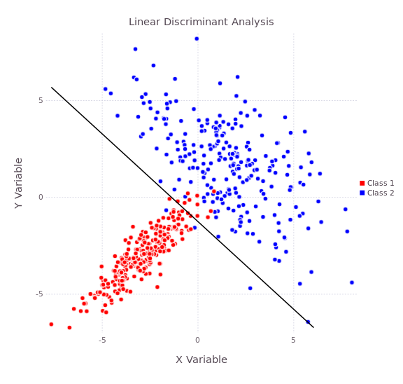

# Discriminant Analysis

**Linear Discriminant Analysis** (LDA) and **Quadratic Discriminant Analysis** (QDA) arise 
as simple probabilistic classifiers. Discriminant Analysis works under the assumption that 
each class follows a Gaussian distribution. That is, for each class $k$, the probability 
distribution can be modelled by the function $f$:

$$
f_k(x) = \frac{\exp\left(\frac{-1}{2}(\mathbf{x}-\mathbf{\mu_k})^{\intercal}\Sigma_k^{-1}(\mathbf{x}-\mathbf{\mu_k})\right)}{(2\pi)^{p/2}\left|\Sigma_k\right|^{1/2}}
$$

where $\mu_k \in \mathbb{R}^p$ is the class mean, $\Sigma_k \in \mathbb{R}^{p \times p}$ is the class covariance matrix and $\mathbf{x} \in \mathbb{R}^p$. Let $\pi_k$ represent the prior class membership probabilities. Application of Baye's 
Theorem allows us to assign a probability to each class membership given an observation
$\mathbf{x}$:

$$
P(K = k | X = \mathbf{x}) = \frac{f_k(\mathbf{x})\pi_k}{\sum_i f_i(\mathbf{x})\pi_i}
$$

We can take the $\argmax$ over $k$ as our classification rule to develop a simple 
classifier. Noting that the probabilities are non-zero and the natural logarithm is
monotonically increasing, the rule can be simplified to:

$$
\argmax_k \left[\ln\left(f_k(\mathbf{x})\right) + \ln(\pi_k) \right]
= \argmax_k \delta_k(\mathbf{x})
$$

The set of functions $\delta_k$ are known as **discriminant functions**. For QDA, the 
discriminant functions are quadratic in $\mathbf{x}$:

$$
\delta_k(\mathbf{x}) = -\frac{1}{2}\left[
    (\mathbf{x}-\mathbf{\mu_k})^{\intercal}\Sigma_k^{-1}(\mathbf{x}-\mathbf{\mu_k})
    + \ln\left|\Sigma_k\right|
\right] + \ln(\pi_k)
$$

LDA has the additional simplifying assumption that $\Sigma_k = \Sigma$ for each class $k$. 
That is, the classes share a common within-class covariance matrix. Since 
the $\mathbf{x}^\intercal \Sigma \mathbf{x}$ and $\ln|\Sigma|$ terms are constant across classes, they can be eliminated since they have no 
impact on the classification rule. The discriminant functions then simplify to a linear rule:

$$
\delta_k(x) = 
    - \mathbf{\mu_k}^{\intercal}\Sigma^{-1}\mathbf{x} 
    + \frac{1}{2}\mathbf{\mu_k}\Sigma^{-1}\mathbf{\mu_k}
    + \ln(\pi_k)
$$

## Data Whitening

Computing a matrix inverse is a computationally intensive procedure. Further, full inversion
of a matrix may introduce numerical error as a result of floating point arithmetic. 
Therefore, data is typically "sphered" or "whitened" to decorrelate predictors and simplify
the discriminant functions while maintaining numerical stability. A whitening transform for a random vector $\mathbf{x}$ with covariance matrix $\Sigma$ is a matrix $\mathbf{W}$ such that:

$$
\operatorname{Var}(\mathbf{Wx})
= \mathbf{W} \Sigma \mathbf{W}^\intercal = \mathbf{I}
\quad \implies \quad
\Sigma^{-1} = \mathbf{W}^\intercal \mathbf{W}
$$

There are several ways to compute a whitening transform given a covariance matrix. Two 
common methods are by the eigendecomposition or by the Cholesky decomposition, respectively:

$$
\Sigma = \mathbf{U} \Lambda \mathbf{U}^\intercal 
\quad\text{or}\quad 
\Sigma = \mathbf{L}\mathbf{L}^\intercal
$$

where $\mathbf{U}$ is an orthogonal matrix, $\Lambda$ is a positive diagonal matrix and 
$\mathbf{L}$ is a lower triangle matrix. This yields two approaches to the whitening 
transform:

$$
\mathbf{W}^{\text{SVD}} = \Lambda^{-\frac{1}{2}}\mathbf{U}^\intercal
\quad \text{and} \quad
\mathbf{W}^{\text{Chol}} = \mathbf{L}^{-1}
$$

For QDA, a whitening matrix is defined for each class covariance matrix $\Sigma_k$. For a specific class $k$, we can define the transformed random vector of $\mathbf{x}$ and transformed
class mean of $\mu$ as:

$$
\tilde{\mathbf{x}}_k = \mathbf{W}_k \mathbf{x}
\quad\text{and}\quad
\tilde{\mu}_k = \mathbf{W}_k \mu_k
$$

Since $\Sigma_k^{-1} = \mathbf{W}_k^\intercal \mathbf{W}_k$, this simplifies the quadratic component of the discriminant function:

$$
(\mathbf{x}-\mathbf{\mu_k})^{\intercal}\Sigma_k^{-1}(\mathbf{x}-\mathbf{\mu_k})
= (\tilde{\mathbf{x}}-\tilde{\mathbf{\mu}}_k)^{\intercal}(\tilde{\mathbf{x}}-\tilde{\mathbf{\mu}}_k)
= ||\tilde{\mathbf{x}}-\tilde{\mathbf{\mu}}_k||_2^2
$$

Therefore, under the whitening transform, the QDA discriminant functions simplify to:

$$
\delta_k(\mathbf{x}) = -\frac{1}{2} \left[
    ||\tilde{\mathbf{x}}-\tilde{\mathbf{\mu}}_k||_2^2
    + \ln\left|\Sigma_k\right|
\right] + \ln(\pi_k)
$$

Similarly, the LDA discriminant functions simplify to:

$$
\delta_k(\mathbf{x}) =
-\frac{1}{2} ||\tilde{\mathbf{x}}-\tilde{\mathbf{\mu}}_k||_2^2 + \ln(\pi_k)
$$

## Canonical Discriminant Analysis (CDA)

Canonical discriminant analysis expands upon linear discriminant analysis by noting that 
the class centroids lie in a $c-1$ dimensional subspace of the $p$ dimensions of the data 
where $c$ is the number of classes. Defining the overall mean and the between-class 
covariance matrix:

$$
\mu = \sum_{k=1}^c \pi_k \mu_k
\qquad \text{and} \qquad
\Sigma_b = \frac{1}{c} \sum_{k=1}^{c} (\mu_k - \mu)(\mu_k - \mu)^{\intercal}
$$

The goal of canonical discriminant analysis is to find the vector(s) that maximize the class
separation. This corresponds to maximizing the generalized Rayleigh quotient:

$$
\argmax_{\mathbf{w}} \frac{\mathbf{w}^{\intercal}\Sigma_b\mathbf{w}}{\mathbf{w}^{\intercal}\Sigma\mathbf{w}}
$$

where $\mathbf{w}$ is a non-zero vector. The problem can be extended to a multiclass case:

$$
\argmax_{\mathbf{W}} \frac{\left|\mathbf{W}^\intercal \Sigma_b \mathbf{W}\right|}{\left|\mathbf{W}^\intercal \Sigma \mathbf{W}\right|}
$$

Solution:

$$
\Sigma_b \mathbf{V} = \Sigma \mathbf{V} \Lambda
$$

$$
\Sigma_b \mathbf{V} = (\mathbf{W}^{\intercal}\mathbf{W})^{-1} \mathbf{V} \Lambda
\quad \implies \quad
\mathbf{W} \Sigma_b \mathbf{V} = \mathbf{W}^{-\intercal} \mathbf{V} \Lambda
$$

Let $\mathbf{A} = \mathbf{W}^{-\intercal}\mathbf{V}$

$$
\mathbf{W} \Sigma_b \mathbf{W}^{\intercal} (\mathbf{W}^{-\intercal} \mathbf{V}) 
= (\mathbf{W}^{-\intercal} \mathbf{V}) \Lambda
\quad \implies \quad
\mathbf{W} \Sigma_b \mathbf{W}^{\intercal} \mathbf{A} = \mathbf{A} \Lambda
$$

## Implementation

In practice, the covariance matrices of the classes are unknown and must be computed from 
the data. A data matrix $\mathbf{X}$ is a matrix of observations that are stored as either 
rows or as columns:

$$
\mathbf{X}_{\text{r}} = \begin{bmatrix}
    \leftarrow & \mathbf{x}_1^\intercal & \rightarrow \\
    \leftarrow & \mathbf{x}_2^\intercal & \rightarrow \\
    & \vdots & \\
    \leftarrow & \mathbf{x}_n^\intercal & \rightarrow
\end{bmatrix}
\quad \text{and} \quad
\mathbf{X}_{\text{c}} = \begin{bmatrix}
    \uparrow & \uparrow & & \uparrow \\
    \mathbf{x}_1 & \mathbf{x}_2 & \cdots & \mathbf{x}_n \\
    \downarrow & \downarrow & & \downarrow
\end{bmatrix}
$$

Given a data sample $\mathcal{D} = \{\mathbf{x}_i \}_{i=1}^n$, if the data vectors have 
been centered by their class mean $\hat{\mu} = \bar{\mathbf{x}} = \frac{1}{n}\sum_{i=1}^n \mathbf{x}_i$

$$
\hat{\Sigma}
= \frac{1}{n-1} \sum_{i=1}^n \mathbf{x}\mathbf{x}^\intercal
\; = \; \frac{1}{n-1} \mathbf{X}_{\text{r}}^\intercal \mathbf{X}_{\text{r}}
\; = \; \frac{1}{n-1} \mathbf{X}_{\text{c}} \mathbf{X}_{\text{c}}^\intercal
$$

For row data, the whitening matrix must be right applied

$$
\mathbf{X}_{\text{r}} = \mathbf{Q}\mathbf{D}\mathbf{V}^\intercal
\quad \implies \quad
\mathbf{W}^{\text{SVD}} = \mathbf{V} \mathbf{D}^{-1}
$$

Using the QR decomposition, the Cholesky whitening matrix can be computed
$$
\mathbf{X}_{\text{r}} = \mathbf{Q}\mathbf{R}
\quad \implies \quad
\mathbf{W}^{\text{Chol}} = \mathbf{R}^{-1}
$$

Similarly for column data, the whitening matrices must be left-applied

$$
\mathbf{X}_{\text{c}} = \mathbf{Q}\mathbf{D}\mathbf{V}^\intercal
\quad \implies \quad
\mathbf{W}^{\text{SVD}} = \mathbf{D}^{-1} \mathbf{Q}^\intercal 
$$

$$
\mathbf{X}_{\text{c}} = \mathbf{L}\mathbf{Q}
\quad \implies \quad
\mathbf{W}^{\text{Chol}} = \mathbf{L}^{-1}
$$

Data matrices

QR
SVD

## Canonical Discriminant Analysis

Then the discriminant functions will simplify

$$
\begin{aligned}
\delta_k(\mathbf{x}) &= -\frac{1}{2}\left[
    (\mathbf{x}-\mathbf{\mu_k})^{\intercal}\Sigma_k^{-1}(\mathbf{x}-\mathbf{\mu_k})
    + \ln\left|\Sigma_k\right|
\right] + \ln(\pi_k) \\
&= -\frac{1}{2}\left[
    \mathbf{x}^{\intercal}\Sigma_k^{-1}\mathbf{x}
    - 2\mu_k^{\intercal}\Sigma_k^{-1}\mathbf{x}
    + 2\mu_k^{\intercal}\Sigma_k^{-1}\mu_k
\right] + \ln(\pi_k)
\end{aligned}
$$

cholesky,eigen whitening

As a result of floating point arithmetic, full inversion of a matrix may
introduce numerical error. Even inversion of a small matrix may produce
relatively large error (see [Hilbert matrices](https://en.wikipedia.org/wiki/Hilbert_matrix)), so alternative methods are 
used to ensure numerical stability.

For two class LDA, the canonical coordinate is perpendicular to the separating
hyperplane produced by the decision boundary. For the LDA model above, the
dimensionality is reduced from 2 to 1. The following image shows the resulting
distribution of points relative to the canonical coordinate:

The following plot shows the quadratic classification boundaries that result 
when a sample data set of two bi-variate Gaussian variables is modelled using 
quadratic discriminant analysis:

The following plot shows the linear classification boundaries that result when a
sample data set of two bi-variate Gaussian variables is modelled using linear
discriminant analysis:

## Using LDA to do QDA

A quadratic boundary using LDA can be generated by squaring each variable and by
producing all the interaction terms. For two variables $x$ and $y$,
this is simply:

$$
x + y + x^2 + y^2 + xy
$$

The transformed variables may be used as inputs for the LDA model. This results
in a quadratic decision boundary:

Note that this boundary does not correspond to the same boundary produced by
QDA.

## Calculation Method

For each class covariance matrix in QDA (or the overall covariance matrix in
LDA), a whitening matrix $W_k$ is computed such that:

$$
\mathbb{V}(X_k W_k) 
    = W_k^{\intercal} \operatorname{V}(X_k) W_k
    = W_k^{\intercal} \mathbf{\Sigma}_k W_k
    = I \quad \implies \quad W = \mathbf{\Sigma}^{-1/2}
$$

This is accomplished using an QR or singular value decomposition of the data 
matrix where possible. When the covariance matrix must be calculated directly,
the Cholesky decomposition is used to whiten the data instead.

Once the whitening matrix has been computed, we can then use the transformation:

$$
\mathbf{z}_k = W_k^{\intercal}\mathbf{x}
\quad \implies \quad Z_k = X W_k
$$

Since we are now working in the transformed space, the determinant goes to zero
and the inverse is simply the identity matrix. This results in the simplified
discriminant function:

$$
\delta_k(\mathbf{z_k}) =  
-\frac{1}{2}(\mathbf{z_k}-\mathbf{\mu_k})^{\intercal}(\mathbf{z_k}-\mathbf{\mu_k})
+ \log(\pi_k)
$$

$$
-\frac{1}{2}\left[
    \mathbf{x}^{\intercal}\Sigma_k^{-1}\mathbf{x}
    - 2\mu_k^{\intercal}\Sigma_k^{-1}\mathbf{x}
    + 2\mu_k^{\intercal}\Sigma_k^{-1}\mu_k
    + \ln\left|\Sigma_k\right|
\right] + \ln(\pi_k)
$$

## References

  * Friedman J. 1989. *Regularized discriminant analysis.* Journal of the American statistical association 84.405; p. 165-175.
  * Hastie T, Tibshirani R, Friedman J, Franklin J. 2005. *The elements of statistical learning: data mining, inference and prediction*. The Mathematical Intelligencer, 27(2); p. 83-85.
